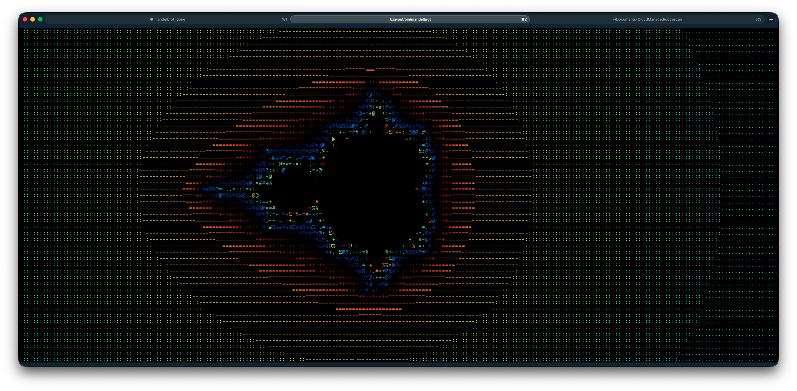

[](https://garnix.io/repo/pmarreck/mandelbrot-zig-tui)
[](https://github.com/pmarreck/mandelbrot-zig-tui/actions/workflows/ci.yml)

# mandelbrot-zig-tui

An interactive terminal-based Mandelbrot set explorer written in pure Zig, capable of rendering 30+ frames per second with true-color 24-bit rendering, a multi-resolution background pre-computation cache, and sub-character-resolution Unicode glyph rendering.



## Features

### Rendering
- **True-color 24-bit rendering** — ANSI `\x1b[38;2;R;G;B` escapes with the Bernstein polynomial palette from the Wikipedia Mandelbrot article; smooth iteration count via `n + 1 - log2(log2(|z|))` eliminates color banding
- **Two glyph modes, toggleable at runtime**:
  - **Density** (default): ASCII density characters `.:-=+*#%@` provide luminance texture alongside color
  - **Blocks**: Unicode quadrant characters (`▖▗▘▙▚▛▜▝▞▟▀▄▌▐█`) render each terminal cell as a 2×2 sub-pixel grid with two-color FG+BG via median-split clustering — 4× spatial resolution for the Mandelbrot set's intricate boundary
- **Adaptive iterations** — max iterations auto-scale with zoom depth via `base + 50 * log2(zoom)`
- **SIGWINCH-responsive** — re-renders on terminal resize without state loss

### Precision & Performance
- **Hardware f64 hot loop with f128 fallback** — f64 by default (fast on Apple Silicon / x86_64), automatically falls back to f128 when zoom exceeds 10^13 (beyond f64's pixel-spacing precision). Soft-float f128 is 30-50x slower than hardware f64 on ARM64; we only pay that cost when precision actually demands it.
- **Multi-threaded rendering** — auto-detects CPU count (cap 12), stride-based row assignment for balanced load across threads. 30-70x end-to-end speedup over the naive baseline on Apple M4 Max.
- **Progressive multi-resolution cache** — 5-level pyramid (1x, 2x, 4x, 8x, 16x) with 3-offset parallel doubling in the background. On idle, background threads progressively fill deeper levels so the next 4 zoom-ins are instant cache hits.
- **Race-free cache invalidation** — generation counter + thread-join barrier; no mutexes, no use-after-free.

### Interaction
- **Mouse navigation** — left-click to zoom in, right-click to zoom out, drag to pan (live re-render), scroll wheel zoom at cursor
- **Keyboard navigation** — `+`/`-` zoom at center, arrow keys pan, `[`/`]` adjust max iterations, `i` toggle info bar, `g` cycle glyph mode, `q` quit
- **Bookmarkable views** — info bar shows a reproducible command (env vars) to restore the exact view from any terminal size
- **Benchmark mode** — `--bench-zoom-sequence N` renders N progressive zoom frames with per-frame timing, perfect for `hyperfine` or scripted perf testing

## Screenshot

The screenshot above shows the Mandelbrot set at the default view: centered at (-0.5, 0.0) with the full set visible, rendered in density mode with the Bernstein polynomial color palette.

## Building

Requires [Nix](https://nixos.org/download.html) with flakes enabled.

```bash
# Build (ReleaseFast, via nix sandbox — reproducible)
./build

# Build debug (zig directly, faster iteration)
./build debug

# Run directly
nix develop -c zig build run

# Run the full test suite (Zig unit tests + CLI integration tests)
./test

# Run benchmarks (ReleaseFast, three scenarios with regression detection)
./bm
```

The binary lands at `zig-out/bin/mandelbrot`.

## Usage

```
mandelbrot [OPTIONS]

Options:
  -h, --help                 Show this help
  --about                    Show version and platform info
  --single-frame             Render one frame to stdout and exit
  --bench-zoom-sequence N    Render N zoom-in frames for perf testing, print timing, exit
  --bench-quiet              With --bench-zoom-sequence: suppress per-frame output
  --glyph=MODE               Initial glyph mode: density (default) or blocks

Controls:
  Left-click     Zoom in 2x at click point
  Right-click    Zoom out 2x at click point
  Drag           Pan (live re-render)
  Scroll wheel   Zoom in/out at cursor
  +/=            Zoom in 2x at center
  -              Zoom out 2x at center
  Arrow keys     Pan
  [/]            Decrease/increase max iterations
  i              Toggle info bar
  g              Cycle glyph mode (density, blocks)
  q / Ctrl-C     Quit

Environment variables (view injection / bookmarking):
  MANDELBROT_CENTER_RE   Center real coordinate
  MANDELBROT_CENTER_IM   Center imaginary coordinate
  MANDELBROT_ZOOM        Zoom level
  MANDELBROT_MAX_ITER    Max iteration count
  MANDELBROT_COLS        Override terminal width
  MANDELBROT_ROWS        Override terminal height
  MANDELBROT_SUBBLOCK    Set to true/1/yes/on to start in blocks mode
```

### Animation mode

Render a scriptable zoom animation (in or out) between the default view and a focal point. Ideal for producing demo GIFs with `asciinema` or `vhs`.

```bash
# Zoom INTO the seahorse valley over 5 seconds at 30fps, pause 2s on final frame, then exit
./mandelbrot \
    --animate \
    --center-re -0.7435 \
    --center-im 0.1314 \
    --zoom-to 1e6 \
    --duration 5 \
    --fps 30 \
    --glyph=blocks \
    --exit-after \
    --hold-ms 2000
```

- Linear interpolation of center coordinates + logarithmic interpolation of zoom produces perceptually uniform visual motion
- Zoom-in direction (`--zoom-from < --zoom-to`) starts at the default view and ends at the focal point; zoom-out flips the direction
- Animation detects non-tty stdout and skips terminal setup, making it pipeable to recording tools or files
- Frame timing stats print to stderr at the end
- Without `--exit-after`, the animation drops into interactive mode at the final state so you can continue exploring

## Architecture

```
src/
  core/                    Pure computation (no I/O, no side effects)
    mandelbrot.zig         f64/f128 escape-time + parallel region fill + 3-offset doubling
    viewport.zig           Screen↔complex mapping, zoom, pan, adaptive iter
    coloring.zig           Bernstein palette + density chars + quadrant glyphs
    cache.zig              5-level resolution pyramid (CacheLevel + CacheStack)
  tui/                     I/O adapter layer
    terminal.zig           Raw mode, mouse (SGR 1002/1006), SIGWINCH, cursor
    input.zig              Byte stream → Event parser (pure)
    renderer.zig           Pure: RenderState + iter_buf → ANSI buffer
    pool.zig               Long-lived coordinator thread for background pre-computation
    app.zig                Event loop + state machine + cache lifecycle
  main.zig                 CLI args, env vars, entry point
```

The `core/` layer is 100% pure functions — no I/O, no allocations beyond caller-provided buffers, no side effects. This is the natural seam for a future C FFI.

## Technical Highlights

Building this ended up touching a surprisingly deep stack of production-grade techniques:

### 1. Hexagonal architecture (ports and adapters)
The `core/` modules (`mandelbrot`, `viewport`, `coloring`, `cache`) are pure computation and data structures. They have no knowledge of terminals, threads, allocators beyond what the caller provides, or stdin/stdout. The `tui/` modules form the adapter layer that handles all I/O. This meant the f64 optimization below could be done entirely in the core with zero TUI changes, and conversely the block quadrant renderer only touched the adapter layer.

### 2. Smooth iteration count for color continuity
The classic escape-time algorithm produces integer iteration counts that cause visible color banding. The "smooth coloring" formula `n + 1 - log2(log2(|z_n|))` produces a continuous real number that interpolates cleanly across the color palette. This requires raising the bailout radius from 2 to 256 so the log-log term converges cleanly.

### 3. f64 hot loop with f128 fallback (30-70x speedup)
Apple Silicon (and most ARM64/x86_64) has no hardware `f128`; soft-float emulation is 30-50x slower than hardware `f64`. Since f64 gives ~15 digits of precision — enough for zoom levels up to ~10^13 on a normal-sized terminal — the inner iteration loop dispatches to a comptime-generic implementation parameterized over float type. Above the precision threshold, it falls back to f128 automatically. Cumulative state (center, zoom, step_re) stays in f128 so precision doesn't drift over many pan/zoom operations.

This alone gave roughly 34x sequential speedup (41 ms → 1.2 ms per 200x60 frame).

### 4. Progressive multi-resolution pre-computation cache
A 5-level resolution pyramid keeps Level 0 at display resolution, Level 1 at 2× density, Level 2 at 4×, etc. Each level covers the same complex-plane bounding box with doubled point density. When the user zooms in 2x, what was Level 1 becomes the new Level 0 (instant), and background threads start computing a new Level 4.

The doubling step uses a clean 3-way parallel decomposition. Going from W×H to 2W×2H, the original W×H points are inherited at even indices; the 3W×H new points fall naturally into three patterns (odd-col/even-row, even-col/odd-row, odd-col/odd-row) that can be computed by 3 independent threads with zero synchronization between them. Each thread does exactly the same amount of work.

### 5. Race-free cache invalidation without mutexes
A long-lived coordinator thread drives the background pre-computation. When the user changes the viewport, the main thread calls `scheduler.stop()` which bumps an atomic generation counter (workers check it per-row and bail) AND joins the coordinator — a full barrier before the cache is invalidated. Subsequent render calls `requestWork()` which respawns a fresh coordinator. No mutexes on the data buffers; generation counter is the sole synchronization primitive.

### 6. Stride-based parallel row assignment
The Mandelbrot set's interior concentrates near the center of the default view, producing severe load imbalance with contiguous row bands (the middle band hits max_iter on every pixel while edges escape quickly). Stride assignment — thread `i` of N processes rows `i, i+N, i+2N, ...` — gives every thread a statistically similar mix of interior and exterior pixels. Improved speedup from 1.55x to 7x on Shallow scenarios with 12 threads.

### 7. Two-color block quadrant rendering (median-split clustering)
In blocks mode, each terminal cell reads a 2×2 grid of sub-pixels and emits a Unicode block quadrant character with two colors (FG + BG). For the 16 possible sub-pixel "on/off" patterns, a lookup table gives the corresponding glyph. Colors are chosen by median-split clustering on the 4 sub-pixel iteration values: sub-pixels above the median go into the FG group, below into BG. Interior (in-set) sub-pixels always go to BG (black). The result: 4× spatial resolution at the boundary, where the Mandelbrot's filigree actually lives.

### 8. SGR mouse protocol with drag tracking
Beyond click-to-zoom: mouse-down records a drag origin, motion events during button-held pan the viewport with per-event re-renders (live drag), and mouse-up only triggers zoom if no drag occurred. Mode 1002 (button-event tracking) reports motion-while-held; mode 1006 (SGR format) supports column/row values above 223 so the protocol works at arbitrary terminal sizes.

### 9. Hypervisor-friendly benchmark harness
The `--bench-zoom-sequence N --bench-quiet` flags make the binary a pure measurement target for `hyperfine`. The `./bm` script tracks speedup ratios across commits and flags regressions >10% in a persistent log. Combined with the Zig unit-test benchmark (`./bm` runs three scenarios: shallow, deep, small), this gives both micro and end-to-end performance telemetry.

## Development Process

This project was built using a structured TDD-first workflow via the [`superpowers` skill suite](https://github.com/anthropics/claude-agent-sdk):

1. **Brainstorm → Spec → Plan → Execute**. Every feature starts with a conversational scoping session that produces a design spec. The spec is reviewed before writing the implementation plan, which is reviewed before any code is written. Only then does implementation begin.
2. **Subagent-driven execution**. Each task in the plan is dispatched to a fresh subagent with exactly the context it needs. Subagents follow TDD rigorously — failing test first, minimum code to pass, refactor — and commit after each task. The supervising agent reviews each subagent's work for spec compliance and code quality before moving to the next task.
3. **Hexagonal discipline**. The module structure (`core/` pure, `tui/` I/O) is enforced by Zig's import graph: `core/` files never import `tui/` files. This makes refactoring safe — the f64 optimization touched only `mandelbrot.zig` and existing tests continued to pass unchanged, proving the change was purely internal.
4. **Everything testable**. The render pipeline is `(state, iter_buf) → ANSI bytes` — a pure function. Deterministic. The buffer can be computed synchronously in tests. The event loop's state transitions (`processEvent`) are likewise pure. 100+ unit tests + 12 CLI tests verify every layer.
5. **Benchmark-driven optimization**. Each perf optimization was isolated in its own commit and measured against the previous commit's benchmark results. The evidence trail lives in `benchmarks/results.log`. No optimization was accepted without a measured improvement.

The specs and plans for each feature are in `docs/superpowers/specs/` and `docs/superpowers/plans/` — they read as a retrospective of how each design decision was made.

## License

MIT
